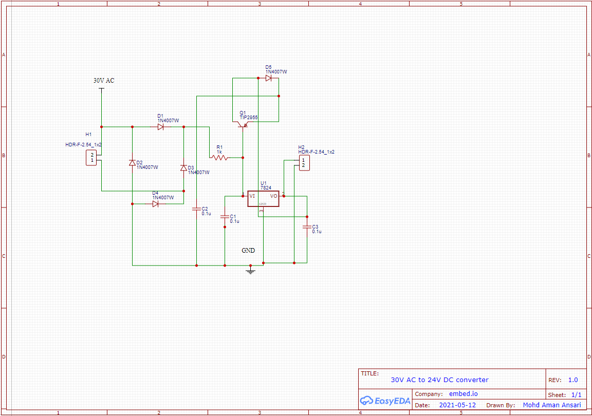
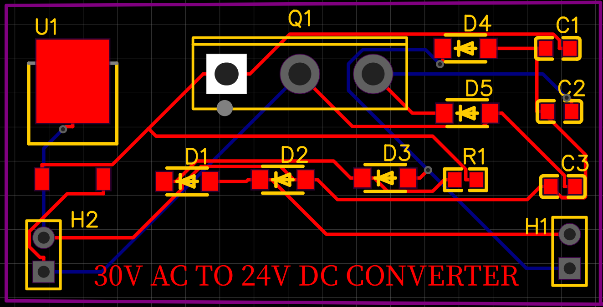
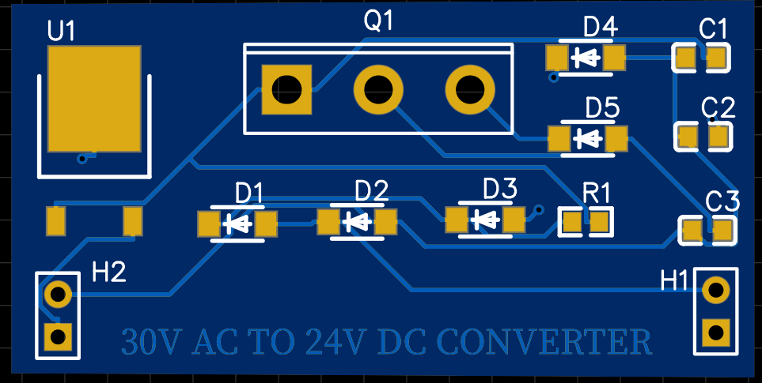
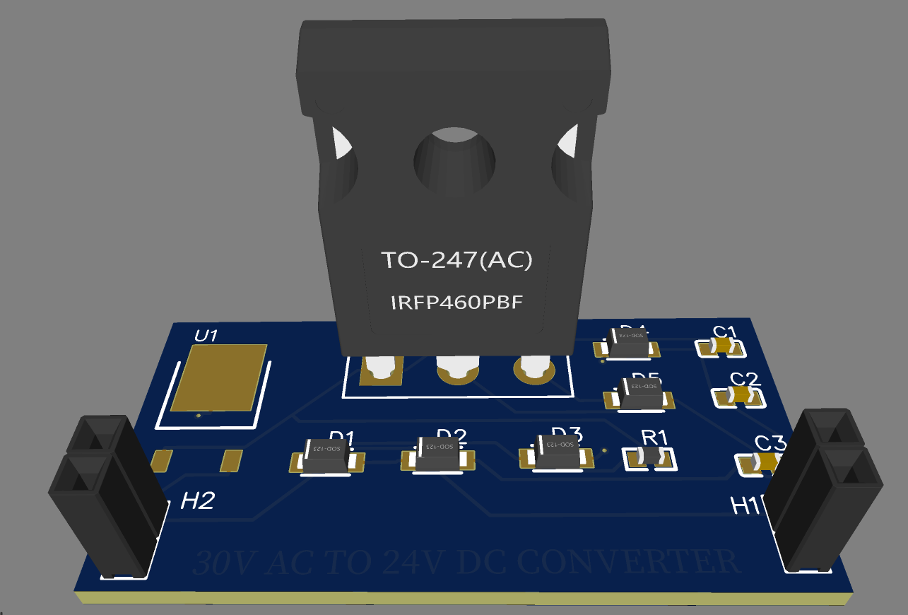

# 30V AC to 24V DC converter

This is a simple circuitary which is convert the 30V AC to 24V DC regulated supply.
In this we are used the tool for designing schematic and PCB is "EASY EDA" which is open source.

### Circuit diagram or schematic

### PCB

### 2D view

### 3D view

